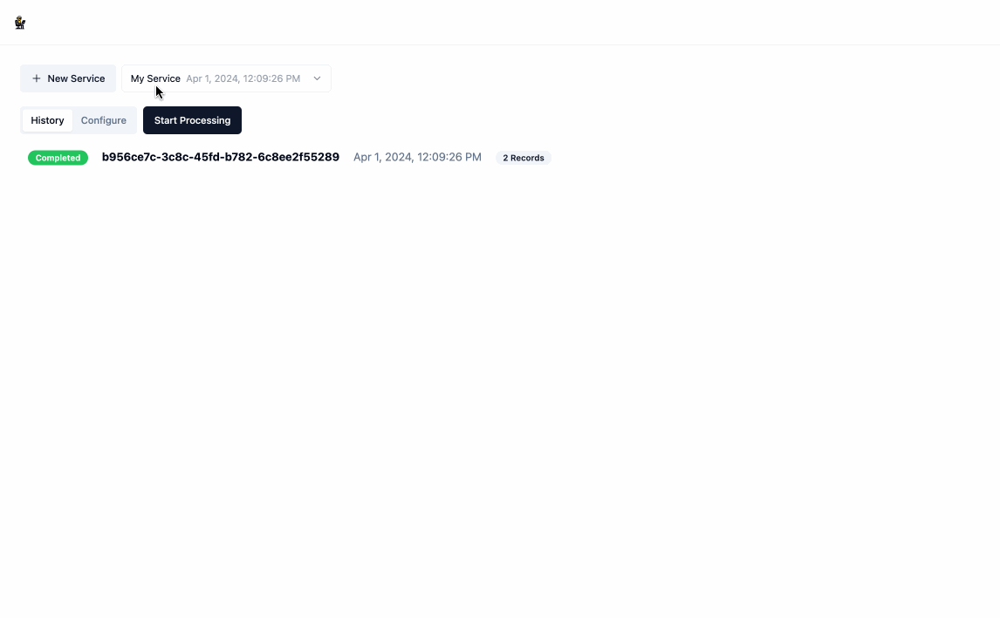

# AutoTransform

AutoTransform is a web application that uses LLMs to automatically handle and transform messy data. Instead of having to constantly monitor and update your code to handle data inputs that don't conform to a pre-defined input schema, AutoTransform will automatically update, test, and deploy your code to handle these constantly changing inputs. Simply define your desired output schema and provide some labeled data via the [UI](#using-the-application) or [REST API](#using-the-api), and let AutoTransform handle the rest. If you want to be able to alter / review / approve the code changes before they are deployed, AutoTransform provides a [git integration](#git) that handles the two-way syncing of your code and output schema.



## Contents

- [Quickstart](#quickstart)
- [Using the Application](#using-the-application)
- [Using the API](#using-the-api)
- [Extensions](#extensions)
  - [Git](#git)
  - [Data](#data)
- [Debugging Prompts](#debugging-prompts)

## Quickstart

[](https://render.com/deploy?repo=https://github.com/pateli18/autotransform)

**Note**: The provided render.yaml does not have a persistent disk attached, which means if the service is restarted and you are using the `local` file provider the input / output data for a given service will be lost. If you want to persist this data, you will need to upgrade the instance type and [attach a persistent disk](https://docs.render.com/disks) to the service.

### Run Locally

1. Set Environment Variables

   - **Required**: `OPENAI_API_KEY` - [Your OpenAI API key](https://platform.openai.com/docs/quickstart/account-setup)

2. Start the application

```
docker compose -f docker-compose.prod.yaml up --build
```

The application is served on [http://localhost:8000](http://localhost:8000)

### Run Development Environment Locally

1. Set Environment Variables

   - **Required**: `OPENAI_API_KEY` - [Your OpenAI API key](https://platform.openai.com/docs/quickstart/account-setup)

2. Start the backend

```
docker compose -f docker-compose.dev.yaml up --build
```

The backend is served on [http://localhost:8000](http://localhost:8000)

3. Install frontend packages (this only needs to be done once)

```
cd frontend; npm install
```

4. Start the frontend

```
cd frontend; npm run start
```

The frontend is served on [http://localhost:3000](http://localhost:3000)

## Using the Application

1. Create a service by clicking the `New Service` button. As part of creating the service, you will need to provide:

   - `Name`
   - `Labeled Data` helps the service undersand how you want the data transformed, the format should be an array of json objects where each object has an `input` key and an `output` key, both of whose values are also json objects.
   - `Output Schema` is a [JSON Schema](https://json-schema.org/) object that represents the structure of the data that will be returned by the service. You don't need to provide your output schema in the JSON Schema syntax, when you click `Parse` the application will automatically convert it for you. You can also auto-generate the _Output Schema_ from the labeled examples by clicking `Use Labeled Data`.


2. Once you have created a service, click `Start Processing` and provide some input data, the format of which is just an array of json objects. This will redirect you to the the `/run` page where you can see the model working in real time to generate the relevant code and output data. You can stop this process at any time by clicking `Stop`.


3. Once the processing is complete, you can download the output data by clicking the download icon next to `Output`. Navigating back to the main page will show you a history of all processing executions and will allow you to update the service's configuration as you see fit.


## Using the API

AutoTransform provides a REST API for interacting with the application. The API is served on [http://localhost:8000](http://localhost:8000/api/v1). You can view the api docs at [http://localhost:8000/docs](http://localhost:8000/docs) when running the application locally.

1. [Create a Service](http://localhost:8000/docs#/config/upsert_config_api_v1_config_upsert_post)

```python
import httpx

response = httpx.post(
    "http://localhost:8000/api/v1/config/upsert",
    json={
        "name": "My Service",
        "user_provided_records": [
            {
                "input": {"phone_entry": "207-307-7621"},
                "output": {"phone_number": "+12073077621"}
            },
            {
                "input": {"phone_entry": "863-811-1187"},
                "output": {"phone_number": "+18638111187"}
            },
        ],
        "output_schema": {"type": "object", "required": ["phone_number"], "properties": {"phone_number": {"type":"string","pattern":"^\\+1[0-9]{10}$|^$"}}}
    }
)
config_id = response.json()["config_id"]
print(config_id)
```

2. [Start Processing](http://localhost:8000/docs#/process/processing_start_api_v1_process_start_post)

```python
import httpx

response = httpx.post(
    "http://localhost:8000/api/v1/process/start",
    json={
        "config_id": config_id,
        "records": [{"phone_entry": "415-854-9030"}, {"phone_entry": "I don't have a phone"}],
    }
)
run_id = response.json()["id"]
print(run_id)
```

3. [Poll for Status](http://localhost:8000/docs#/process/processing_status_api_v1_process_status__config_id___run_id__get)

```python
import httpx
from time import sleep

while True:
    response = httpx.get(
        f"http://localhost:8000/api/v1/process/status/{config_id}/{run_id}"
    )
    status = response.json()["status"]
    print(status)
    if status != "running":
        break
    else:
        sleep(5)
```

4. [Retrieve Data](http://localhost:8000/docs#/data/export_api_v1_data_export__config_id___run_id___data_type__get)

```python
import httpx
import json

data = []
with httpx.stream(
    "GET",
    f"http://localhost:8000/api/v1/data/export/{config_id}/{run_id}/output"
) as r:
    for line in r.iter_lines():
        d = json.loads(line)
        data.append(d)

print(len(data))
print(data[0])
```

## Extensions

### Git


AutoTransform provides a git extension that allows you to store your services code and output schema in a git repository. You can even use the git repository to block output schema and code updates from being applied to your service without a human review. To use the git extension, you will need to provide the following environment variables:

- **GIT_PROVIDER**: The git provider you are using, currently only `github` is supported
- **GIT_PROVIDER_SECRET**: A secret token that allows the application to access your git repository
  - `github`: this is your [personal access token](https://github.com/settings/tokens?type=beta). It should have the following permissions:
    - _metadata_ - read
    - _code_ - read and write
    - _pull requests_ - read and write

The git settings for individual services can be configured within the `Git Settings` portion of the service config.

You can add other git providers by:

1. Adding a new class that inherits from [GitClient](./backend/autotransform/autotransform_types.py#L467). See [github.py](./backend/autotransform/git/github.py) for an example.
2. Updating the [get_git_client](./backend/autotransform/git/__init__.py#L23) function to return your new class when the `GIT_PROVIDER` environment variable is set to the name of your new class.
3. Updating the [GitProviderType](./backend/autotransform/utils.py#L12) enum to include your new provider

### File

AutoTransform provides a file extension that allows you to store your files in the storage provider of your choice. To use the file extension, you will need to provide the following environment variables:

- **FILE_PROVIDER**: The file provider you are using, currently only `local` is supported
- **FILE_PROVIDER_CONFIG**: A string that contains the configuration for your file provider. The format of this object is specific to the provider you are using.
  - For `local` the format is a json obejct with the following keys:
    - **save_path**: The path to the directory where you want to store your files

You can add other file proviers by:

1. Adding a new class that inherits from [FileClient](./backend/autotransform/autotransform_types.py#L572). See [local.py](./backend/autotransform/file/local.py) for an example.
2. Updating [\_\_init\_\_.py](./backend/autotransform/file/__init__.py#L23) to return your new class when the `FILE_PROVIDER` environment variable is set to the name of your new class.
3. Updating the [FileProviderType](./backend/autotransform/utils.py#L8) enum to include your new provider

## Debugging Prompts

AutoTransform will display the prompts used to generate the code and schema in the `/run` view, just make sure you have the **PROCESSING_DEBUG** environment variable set to `true`.


